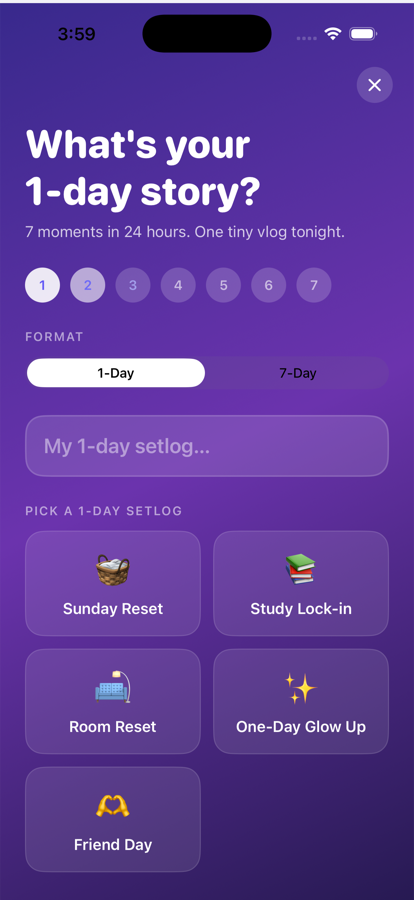
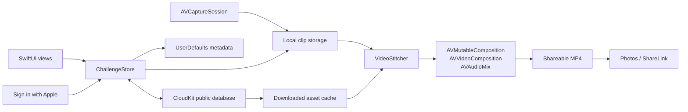

# 1Day

**Capture seven tiny moments. Get one film worth keeping.**

1Day is a native iOS app for solo and shared video challenges. A participant
records 2–10 second clips across a day or a week; the app assembles them
on-device into a finished vertical film.

<p align="center">
  
  &nbsp;&nbsp;
  
</p>

> The GIF shows the deterministic seven-clip rendering proof of concept. The
> production iOS renderer uses AVFoundation and is covered by integration tests.

## What it does

- Records front- or rear-camera clips with audio through `AVCaptureSession`
- Supports one-day stories and seven-day challenges with 2, 5, or 10 second clips
- Creates solo challenges or CloudKit-backed rooms joined with a six-character code
- Authenticates shared-room participants with Sign in with Apple
- Replaces re-recorded clips deterministically instead of creating duplicates
- Renders sequential films with crossfades or multi-participant grid films
- Burns in title cards, moment labels, creator identity, captions, dates, and times
- Saves finished MP4 videos to Photos or shares them through the iOS share sheet
- Opens shared challenges from `aisetlog://join?code=XXXXXX` deep links

## Architecture



The app keeps local challenge metadata separate from video files. Shared rooms
store room metadata and clip assets in CloudKit; downloaded assets are cached
locally before entering the same renderer used by solo challenges.

## Engineering decisions

### Render on-device

AVFoundation keeps personal video off a custom server, removes a render-service
dependency, and works offline after shared clips are downloaded. The tradeoff is
device-specific media behavior and more careful handling of track transforms,
audio ranges, and simulator limitations.

### Deterministic CloudKit record IDs

A shared clip uses `room + participant + slot` as its record identity. Re-recording
updates the same record, making replacement idempotent and avoiding duplicate
clips. This is simpler than maintaining a separate version graph, but it
intentionally preserves only the latest take.

### Direct room lookup

The six-character room code is also the CloudKit `Room` record name. Joining is
a direct record fetch instead of a query. Codes are convenient to share, though
they are invitations—not security secrets.

### Local-first state

Solo challenges work without an account. Shared rooms add Sign in with Apple and
CloudKit only when needed. This reduces onboarding friction, while requiring a
clear merge boundary between local clips and the downloaded room cache.

## Project layout

```text
ios/
├── AISetlog/
│   ├── Services/       # CloudKit, account, and video rendering
│   ├── Views/          # SwiftUI product flow and camera
│   ├── ChallengeStore.swift
│   └── Models.swift
├── AISetlogTests/      # State tests and real video-export integration tests
└── project.yml         # XcodeGen project definition
landing-page/           # Vite/React marketing page
poc/                    # Reproducible FFmpeg rendering proof of concept
```

## Build and test

Requirements: macOS, Xcode 17 or newer, and iOS 17 or newer.

```bash
cd ios
xcodegen generate --spec project.yml
xcodebuild test \
  -project AISetlog.xcodeproj \
  -scheme AISetlog \
  -destination 'platform=iOS Simulator,name=iPhone 17' \
  CODE_SIGNING_ALLOWED=NO
```

The test suite verifies challenge completion and card-state transitions, custom
moment labels, empty renderer input, sequential crossfade export, and grid export
duration. The renderer tests load real MP4 assets and assert that AVFoundation
produces playable, non-empty output.

CloudKit collaboration and Sign in with Apple require an Apple developer team,
the `iCloud.com.cassie.AISetlog` container, and the matching entitlements.

## Beta status

This is currently an **independent iOS project**, not an App Store launch. A
5–10-person beta protocol and an empty, privacy-safe results template are in
[docs/BETA_TESTING.md](docs/BETA_TESTING.md). No adoption or completion metrics
will be claimed until those sessions have happened.

## License

[MIT](LICENSE)
