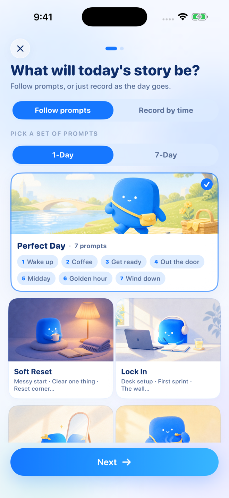
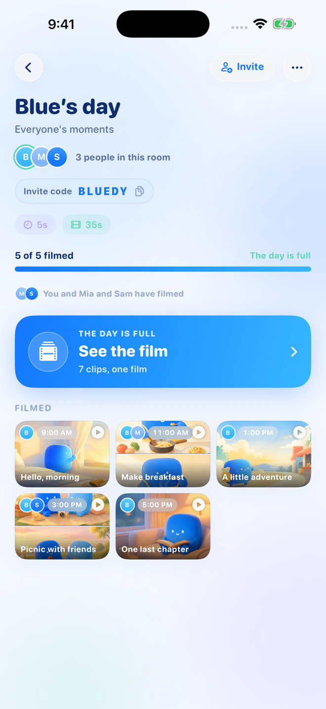
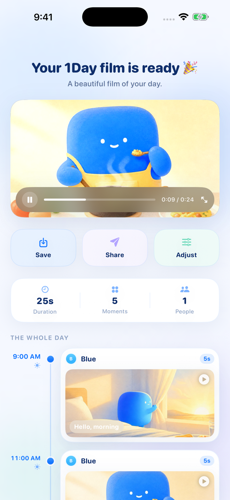
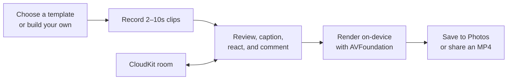
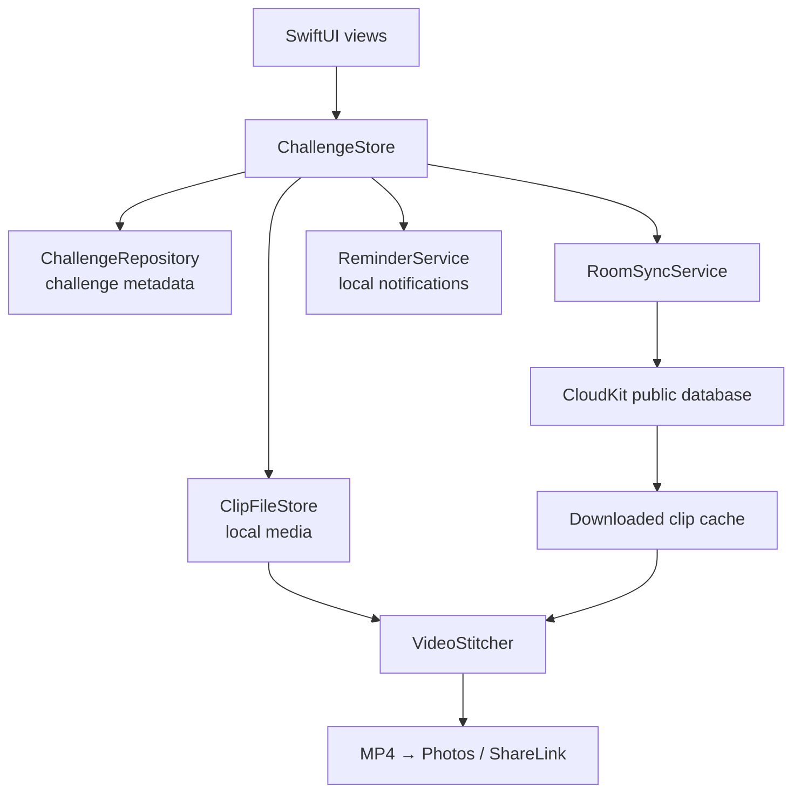

# 1Day

**Give today a theme. Live it your way, on your own or with friends, and turn it into a vlog.**

1Day starts with a question: **How do you want to spend today?** Choose a theme,
follow a few moment prompts, and capture the day on your own or with friends.
The finished vlog is your keepsake. The native iOS app supports one-day and
seven-day stories, with film assembly entirely on-device.

**Theme → Moments → Together → Film**

[Website](https://1day.liangyue.site) · [English website](https://1day.liangyue.site/en) · [App Store](https://apps.apple.com/cn/app/1-day/id6794565199?uo=4) · [App release notes](https://1day.liangyue.site/en/updates)

<p align="center">
  
  &nbsp;&nbsp;
  
  &nbsp;&nbsp;
  
</p>

Real App UI captured in an isolated iOS Simulator build. Blue’s illustrated
story and the shared participants are demo data, not user footage or evidence
of a live multiplayer session.

## Version 1.2: a day your way

The current development version focuses on making it easier to design,
capture, and revisit your own day:

- **From an idea to moments.** Describe what you want to do today, request
  filming suggestions, then edit the prompts yourself.
- **Themes worth keeping.** Save custom prompts to your template library with
  a cover, ready to use again.
- **Film in your own order.** Choose any available moment rather than follow
  a fixed recording sequence.
- **Keep watching.** Review solo-story clips full-screen and swipe between them.
- **A gentle look.** Adjust softness, brightness, and warmth for playback and
  export while preserving the original footage.
- **Know who is there.** Shared stories make participants and filming status
  clearer; solo stories omit the shared-room UI.

Version 1.2 is **not yet listed as released**. The latest App Store version
verified on September 8, 2026 was **1.1**, released August 25, 2026. Repository
features and demo screenshots may be ahead of the store build.

## The idea

Most days are remembered through a few small moments, not one long recording.
1Day gives each moment a prompt, keeps every clip intentionally short, and does
the editing at the end. The result is a personal film without a camera roll full
of footage or an evening spent in a video editor.

## Product highlights

- **One day or seven.** Capture several moments today, or return for one clip a
  day over a week.
- **Guided or personal.** Start from bilingual themes, create your own prompts,
  or record by time without a prompt sequence.
- **Short by design.** Choose 2, 5, or 10-second clips and lock the challenge to
  portrait or landscape.
- **Made with friends.** Create a CloudKit room, invite people with a six-character
  code, and collect everyone’s clips in one shared story.
- **More than a clip feed.** Friends can leave emoji reactions and comments;
  those interactions can appear in the final film.
- **A real camera workflow.** Switch between front and rear cameras, review a
  take, add overlay text, or re-record the same moment.
- **Automatic editing.** AVFoundation assembles clips with audio, crossfades,
  title cards, prompt captions, names, dates, reactions, and comments.
- **Your film, your choice.** Preview the result, adjust its title card, captions,
  and transition length, then save it to Photos or share the MP4.
- **Local-first.** Solo challenges need no account or custom backend. An optional,
  configurable evening reminder sends at most one nudge and skips completed moments.
- **Quiet shared activity.** Opt-in CloudKit subscriptions summarize nearby friend
  clips, comments, and reactions without putting comment text in notifications.
- **English and Simplified Chinese.** Product copy, prompts, templates, and
  permission messaging follow the selected app language.

## How it works


```mermaid
flowchart LR
    Create["Choose a template<br/>or build your own"] --> Record["Record 2–10s clips"]
    Record --> Review["Review, caption,<br/>react, and comment"]
    Review --> Render["Render on-device<br/>with AVFoundation"]
    Render --> Keep["Save to Photos<br/>or share an MP4"]

    Room["CloudKit room"] <--> Review
```

## Engineering

### On-device media pipeline

`VideoStitcher` loads and normalizes each asset, preserves camera transforms,
builds alternating composition tracks, mixes audio through crossfades, and adds
Core Animation overlays through `AVVideoCompositionCoreAnimationTool`. Export
produces a shareable MP4 without sending personal footage to a render server.

The tradeoff: device media behavior is less predictable than a centralized
renderer. The implementation explicitly handles orientation, track lifetimes,
audio ranges, empty input, and simulator limitations.

### Local-first service boundaries

`ChallengeStore` owns observable app state but delegates storage and I/O:


```mermaid
flowchart TD
    Views["SwiftUI views"] --> Store["ChallengeStore"]
    Store --> Repo["ChallengeRepository<br/>challenge metadata"]
    Store --> Files["ClipFileStore<br/>local media"]
    Store --> Sync["RoomSyncService"]
    Sync --> Cloud["CloudKit public database"]
    Store --> Reminder["ReminderService<br/>local notifications"]
    Files --> Stitcher["VideoStitcher"]
    Cloud --> Cache["Downloaded clip cache"]
    Cache --> Stitcher
    Stitcher --> Film["MP4 → Photos / ShareLink"]
```

This keeps the core flow usable offline and isolates persistence, collaboration,
notifications, capture, and rendering behind focused components.

### Idempotent collaboration

A shared clip’s CloudKit record ID is derived from `room + participant + slot`.
Re-recording updates the same record instead of creating a duplicate. The room
code is also the `Room` record name, so joining is a direct record fetch rather
than a query. Codes are convenient invitations, not security secrets.

### Backward-compatible state

Saved challenges use stable prompt keys and version-tolerant decoding. Legacy
English or Chinese prompt strings, older challenge defaults, and the original
single-challenge storage shape are migrated or resolved without discarding a
user’s clips.

### Optional prompt suggestions

The core solo recording flow stays on-device. If the user requests suggestions,
the app sends their sentence, prompt count, language, and a random installation
identifier to a Cloudflare Worker. The Worker uses DeepSeek to suggest prompts;
it does not receive the user’s video clips. Users can also write prompts without
calling this service. See [the Worker](workers/suggest-prompts) for configuration.

## Tech stack

| Area | Implementation |
| --- | --- |
| App | Swift 5.9, SwiftUI, Observation, iOS 17+ |
| Capture | AVFoundation (`AVCaptureSession`, `AVCaptureMovieFileOutput`) |
| Rendering | AVMutableComposition, AVVideoComposition, AVAudioMix, Core Animation |
| Collaboration | CloudKit public database, Sign in with Apple, deep links |
| Persistence | Codable metadata in UserDefaults, media on disk |
| Notifications | UserNotifications |
| Website | React 19, Vite 6, prerendered bilingual routes, Vercel |
| Optional prompt suggestions | Cloudflare Worker, DeepSeek |
| Project generation | XcodeGen |
| Tests | XCTest with real MP4 export fixtures |

## Repository layout

```text
ios/
├── AISetlog/
│   ├── App/               # App entry point and lifecycle
│   ├── Models/            # Challenges, cards, clips, templates, interactions
│   ├── Presentation/      # Localized presentation logic
│   ├── Resources/         # Theme, localization, and media fixtures
│   ├── Services/
│   │   ├── Cloud/         # CloudKit records and room synchronization
│   │   ├── Media/         # Camera capture and AVFoundation renderer
│   │   └── Persistence/   # Metadata repository and clip file store
│   └── Views/             # Home, board, recorder, reel, and settings
├── AISetlogTests/          # State, localization, migration, and export tests
└── project.yml             # XcodeGen project definition
landing-page/               # React/Vite product site
workers/suggest-prompts/    # Optional filming-prompt service
docs/                       # Product specs, beta protocol, and assets
```

## Run the iOS app

### Requirements

- macOS with Xcode and the iOS 17 SDK or newer
- [XcodeGen](https://github.com/yonaskolb/XcodeGen)

```bash
cd ios
xcodegen generate --spec project.yml
open AISetlog.xcodeproj
```

Select the `AISetlog` scheme and run it on an iPhone or iOS Simulator. The
simulator can exercise the product flow and export fixtures; camera behavior and
Core Animation render overlays should be verified on a physical device.

Shared rooms additionally require:

- an Apple Developer team
- the `iCloud.com.cassie.AISetlog` CloudKit container
- matching CloudKit and Sign in with Apple entitlements
- a device signed in to iCloud

## Run the landing page

Source: [`landing-page/`](landing-page). The production site is
[1day.liangyue.site](https://1day.liangyue.site).

Routes: `/` and `/en` for the product site, `/updates` and `/en/updates` for
App release notes, and `/privacy` and `/en/privacy` for privacy information.


```bash
cd landing-page
npm install
npm run dev
```

For a production build and local preview:

```bash
npm run build
npm run preview
```

The build generates the client bundle and prerenders all six routes. App
screenshots and the illustrated demo film live in `landing-page/public/assets`.
The demo film has optional Chinese and English captions; below-the-fold images
load lazily and the video waits for playback before loading.

## Test

```bash
cd ios
xcodegen generate --spec project.yml
xcodebuild test \
  -project AISetlog.xcodeproj \
  -scheme AISetlog \
  -destination 'platform=iOS Simulator,name=iPhone 17' \
  -skip-testing:AISetlogTests/CloudKitIdempotencyTests \
  -skip-testing:AISetlogTests/CloudKitPaginationTests \
  -skip-testing:AISetlogTests/RoomSyncIntegrationTests \
  -skip-testing:AISetlogTests/JoinedRoomTests \
  CODE_SIGNING_ALLOWED=NO
```

The suite covers challenge and card state, one-day behavior, localized prompt
resolution, legacy data decoding, empty renderer input, and playable
AVFoundation MP4 export with real media fixtures.

The four skipped suites talk to the real CloudKit development database. Run
them separately on a signed simulator or device that is signed into iCloud;
an unsigned test host has no CloudKit entitlement, and constructing the
container terminates the process before XCTest can skip the test.

## Project status

1Day is available on the
[App Store](https://apps.apple.com/cn/app/1-day/id6794565199?uo=4). The testing
protocol and privacy-safe results template remain in
[docs/BETA_TESTING.md](docs/BETA_TESTING.md); the repository does not claim
adoption or completion metrics that have not been measured.

## License

[MIT](LICENSE)
