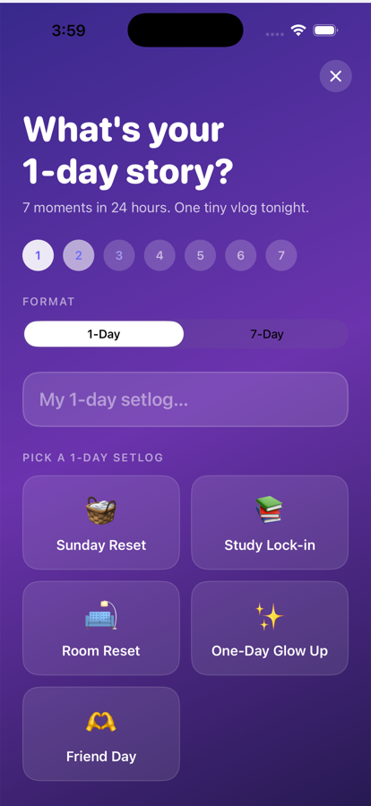
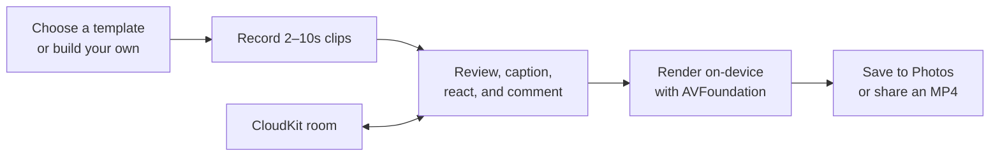
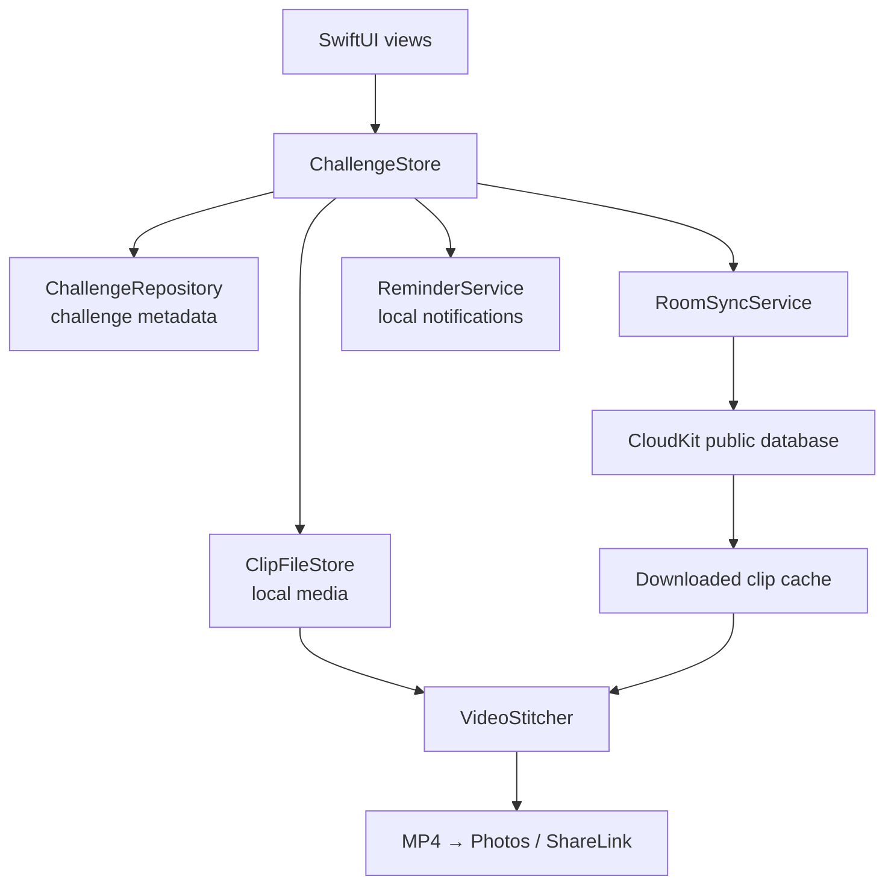

# 1Day

**Capture the moments that usually disappear. Turn them into a film worth keeping.**

1Day is a native iOS video diary for solo and shared challenges. Record a few
seconds at a time—across one day or seven—and the app turns those clips into a
finished film, entirely on-device.

<p align="center">
  
  &nbsp;&nbsp;
  
</p>

> The animation shows the original deterministic rendering proof of concept.
> The iOS app now records and renders with AVFoundation.

## The idea

Most days are remembered through a few small moments, not one long recording.
1Day gives each moment a prompt, keeps every clip intentionally short, and does
the editing at the end. The result is a personal film without a camera roll full
of footage or an evening spent in a video editor.

## Product highlights

- **One day or seven.** Capture several moments today, or return for one clip a
  day over a week.
- **Guided or personal.** Start from bilingual built-in templates or build a
  custom sequence of prompts.
- **Short by design.** Choose 2, 5, or 10-second clips and lock the challenge to
  portrait or landscape.
- **Made with friends.** Create a CloudKit room, invite people with a six-character
  code, and collect everyone’s clips in one shared story.
- **More than a clip feed.** Friends can leave emoji reactions and comments;
  those interactions can appear in the final film.
- **A real camera workflow.** Switch between front and rear cameras, review a
  take, add overlay text, or re-record the same moment.
- **Automatic editing.** AVFoundation assembles clips with audio, crossfades,
  title cards, prompt captions, names, dates, reactions, and comments.
- **Your film, your choice.** Preview the result, adjust its title card, captions,
  and transition length, then save it to Photos or share the MP4.
- **Local-first.** Solo challenges need no account or custom backend. An optional,
  configurable evening reminder sends at most one nudge and skips completed moments.
- **Quiet shared activity.** Opt-in CloudKit subscriptions summarize nearby friend
  clips, comments, and reactions without putting comment text in notifications.
- **English and Simplified Chinese.** Product copy, prompts, templates, and
  permission messaging follow the selected app language.

## How it works


```mermaid
flowchart LR
    Create["Choose a template<br/>or build your own"] --> Record["Record 2–10s clips"]
    Record --> Review["Review, caption,<br/>react, and comment"]
    Review --> Render["Render on-device<br/>with AVFoundation"]
    Render --> Keep["Save to Photos<br/>or share an MP4"]

    Room["CloudKit room"] <--> Review
```

## Engineering

### On-device media pipeline

`VideoStitcher` loads and normalizes each asset, preserves camera transforms,
builds alternating composition tracks, mixes audio through crossfades, and adds
Core Animation overlays through `AVVideoCompositionCoreAnimationTool`. Export
produces a shareable MP4 without sending personal footage to a render server.

The tradeoff: device media behavior is less predictable than a centralized
renderer. The implementation explicitly handles orientation, track lifetimes,
audio ranges, empty input, and simulator limitations.

### Local-first service boundaries

`ChallengeStore` owns observable app state but delegates storage and I/O:


```mermaid
flowchart TD
    Views["SwiftUI views"] --> Store["ChallengeStore"]
    Store --> Repo["ChallengeRepository<br/>challenge metadata"]
    Store --> Files["ClipFileStore<br/>local media"]
    Store --> Sync["RoomSyncService"]
    Sync --> Cloud["CloudKit public database"]
    Store --> Reminder["ReminderService<br/>local notifications"]
    Files --> Stitcher["VideoStitcher"]
    Cloud --> Cache["Downloaded clip cache"]
    Cache --> Stitcher
    Stitcher --> Film["MP4 → Photos / ShareLink"]
```

This keeps the core flow usable offline and isolates persistence, collaboration,
notifications, capture, and rendering behind focused components.

### Idempotent collaboration

A shared clip’s CloudKit record ID is derived from `room + participant + slot`.
Re-recording updates the same record instead of creating a duplicate. The room
code is also the `Room` record name, so joining is a direct record fetch rather
than a query. Codes are convenient invitations, not security secrets.

### Backward-compatible state

Saved challenges use stable prompt keys and version-tolerant decoding. Legacy
English or Chinese prompt strings, older challenge defaults, and the original
single-challenge storage shape are migrated or resolved without discarding a
user’s clips.

## Tech stack

| Area | Implementation |
| --- | --- |
| App | Swift 5.9, SwiftUI, Observation, iOS 17+ |
| Capture | AVFoundation (`AVCaptureSession`, `AVCaptureMovieFileOutput`) |
| Rendering | AVMutableComposition, AVVideoComposition, AVAudioMix, Core Animation |
| Collaboration | CloudKit public database, Sign in with Apple, deep links |
| Persistence | Codable metadata in UserDefaults, media on disk |
| Notifications | UserNotifications |
| Website | React 19, Vite 6 |
| Project generation | XcodeGen |
| Tests | XCTest with real MP4 export fixtures |

## Repository layout

```text
ios/
├── AISetlog/
│   ├── App/               # App entry point and lifecycle
│   ├── Models/            # Challenges, cards, clips, templates, interactions
│   ├── Presentation/      # Localized presentation logic
│   ├── Resources/         # Theme, localization, and media fixtures
│   ├── Services/
│   │   ├── Cloud/         # CloudKit records and room synchronization
│   │   ├── Media/         # Camera capture and AVFoundation renderer
│   │   └── Persistence/   # Metadata repository and clip file store
│   └── Views/             # Home, board, recorder, reel, and settings
├── AISetlogTests/          # State, localization, migration, and export tests
└── project.yml             # XcodeGen project definition
landing-page/               # React/Vite product site
poc/                        # Reproducible FFmpeg rendering proof of concept
docs/                       # Beta protocol and README assets
```

## Run the iOS app

### Requirements

- macOS with Xcode and the iOS 17 SDK or newer
- [XcodeGen](https://github.com/yonaskolb/XcodeGen)

```bash
cd ios
xcodegen generate --spec project.yml
open AISetlog.xcodeproj
```

Select the `AISetlog` scheme and run it on an iPhone or iOS Simulator. The
simulator can exercise the product flow and export fixtures; camera behavior and
Core Animation render overlays should be verified on a physical device.

Shared rooms additionally require:

- an Apple Developer team
- the `iCloud.com.cassie.AISetlog` CloudKit container
- matching CloudKit and Sign in with Apple entitlements
- a device signed in to iCloud

## Run the landing page

```bash
cd landing-page
npm install
npm run dev
```

## Test

```bash
cd ios
xcodegen generate --spec project.yml
xcodebuild test \
  -project AISetlog.xcodeproj \
  -scheme AISetlog \
  -destination 'platform=iOS Simulator,name=iPhone 17' \
  CODE_SIGNING_ALLOWED=NO
```

The suite covers challenge and card state, one-day behavior, localized prompt
resolution, legacy data decoding, empty renderer input, and playable
AVFoundation MP4 export with real media fixtures.

## Project status

1Day is an independent iOS project in private beta, not an App Store release.
The testing protocol and privacy-safe results template live in
[docs/BETA_TESTING.md](docs/BETA_TESTING.md). No adoption or completion metrics
are claimed before those sessions take place.

## License

[MIT](LICENSE)
