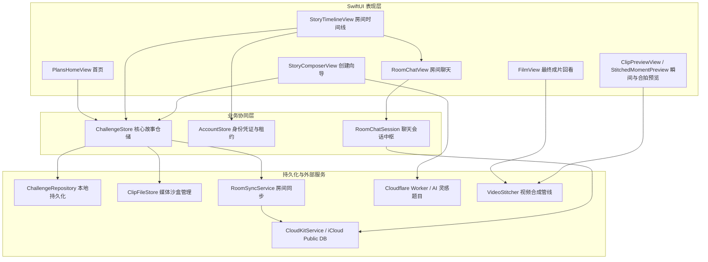

# 1day — 整体技术方案 (Technical Architecture Plan)

> 最新更新：2026-09-11  
> 职责定位：本文件定义**系统架构、数据流转、服务边界、媒体与渲染规范、安全隔离守则**；产品定义见 `product_requirements.md`，执行与验证流水见 `progress.md`。

---

## 1. 系统总体架构与拓扑

1day 采用典型的声明式单向数据流与领域服务分层设计：



---

## 2. 核心模块与代码定位

| 模块名称 | 核心文件路径 (相对 `ios/AISetlog/`) | 职责与技术边界 |
|:---|:---|:---|
| **故事与模型** | `Models/Challenge.swift`, `DayCard.swift`, `DayClip.swift` | 定义挑战模式（一天/七天）、瞬间结构、独立作者素材。内置 6 套预置模板。 |
| **持久化层** | `Services/ChallengeStore.swift`, `Services/Persistence/*` | 聚合故事、模板、文件沙盒与同步动作。防范 `didSet` 产生非预期副作用。 |
| **身份与租约** | `Services/AccountStore.swift` | 维护 Apple ID 凭据及 `identityRevision` 租约，避免登出/换号后迟到回调写穿。 |
| **视频合成管线** | `Services/Media/VideoStitcher.swift` | 基于 AVFoundation 的视频轨道混流、滤镜、画幅重整 (`friendsTogether`) 与音频融合。 |
| **独立房间演示** | `Services/Persistence/LocalRoomDemoStorage.swift`, `Services/RoomVideoDemoModel.swift` | 演示专用临时沙盒与模型，杜绝假房间写入真实云端数据库。 |
| **聊天中枢** | `Models/RoomChatState.swift`, `Services/RoomChatSession.swift` | 统一房间聊天流、outbox 离线排队、UUID 幂等去重、删除标记 tombstone 存储。 |
| **AI 建议** | `Services/PromptSuggestionService.swift`, `workers/suggest-prompts/` | 客户端 20s 超时兜底，Worker 注入 API 秘钥，支持意图直出与可选标题回传。 |

---

## 3. 关键数据契约与不变量

### 3.1 房间聊天规范 (Room Chat Contract)
1. **作用域唯一性**：逻辑作用域绑定为 `accountID + roomCode`，瞬间 (moment/day) 仅作为引用的附加上下文，不作为消息可见性过滤条件。
2. **幂等发送与 Outbox**：消息分配持久 UUID，网络发送前先入本地磁盘 outbox。重试沿用原始 UUID 与创建时间戳，网络端根据 UUID 去重。
3. **作者删除原则**：消息仅允许其 `authorID` 删除，删除通过标记 `deletedIDs` 本地固化；即使拉取历史快照出现该消息，亦严禁复活。
4. **硬性容量限制**：单条消息限制 2000 UTF-8 字符；发送失败保持草稿，不丢失用户输入。

### 3.2 媒体与画幅合成规范 (Media & Composition)
1. **原片只读原则**：相机原始录制或用户相册导入的视频文件作为只读素材，所有调色、加字、画幅重切均为下游派生产物，绝不覆写源文件。
2. **互补反转画幅默认原则 (ADR-08 / build20)**：
   * **竖屏素材** (Height > Width) $\rightarrow$ 默认合成 **横版 16:9**。
   * **横屏素材** (Width > Height) $\rightarrow$ 默认合成 **竖版 9:16**。
   * **方形素材** $\rightarrow$ 默认保持 1:1。
   * **显式覆盖优先**：若用户明确选定“横版/竖版”，则强制遵循用户选择。
3. **无裁切与毛玻璃留白规范 (P3 / 方案 A，已落地)**：
   * `friendsTogether` 由 `FriendsTogetherCompositor`（自定义 `AVVideoCompositing`）合成，**不是** layer instruction。原因是硬约束：`AVMutableVideoCompositionLayerInstruction` 只支持 transform / crop / opacity，没有任何模糊能力。
   * 每个 cell 两层：**aspect-fill → clamp → `CIGaussianBlur`（cell 短边 5%）→ 压暗 0.08** 作铺底；**aspect-fit 完整画面居中**作前景。素材不再被裁掉任何部分。
   * 方向必须经 `CGImagePropertyOrientation` + `CIImage.oriented()` 处理，**严禁**把 `preferredTransform` 直接应用到 `CIImage`：前者是 top-left 显示空间，后者是 bottom-left，直接用会镜像每一个旋转。
   * 自定义 compositor 接管**整个** composition，包括片头无源黑场。`startRequest` 必须对不认识的 instruction 返回纯黑帧。仅在 `.friendsTogether` 时设置 `customVideoCompositorClass`，顺序成片继续走系统路径。
4. **官方 CIFilter 调色规范 (P1，已落地)**：
   * `PersonalEffectParameters` 是唯一模型：曝光 / 色温 / 对比，`-50 ~ +50`，0 = 原样直接透传。旧的 `GentleLook`（0…1 的 smoothing/brightness/warmth 加四个写死预设）已整体删除。
   * 渲染顺序固定为 `CIExposureAdjust` → `CITemperatureAndTint` → `CIColorControls`。曝光必须在对比之前：反过来会把高光推上去再削掉，画面最亮的细节就没了。
   * **符号方向**：`CITemperatureAndTint` 朝目标白点校正，所以「更暖」对应**更低**的 `targetTemperature`。写反在算术上看不出来，在脸上就是蓝的。
   * 调色只作用于本人素材：`VideoStitcher.Options.lookAuthorID` 限定范围，合拍时不碰好友的片段——他们是在自己的光线下拍的。
   * 存储键 `personalEffect.v2`。旧的 `gentleLook.v1` **不迁移**：`smoothing` 在新模型里没有对应维度，硬映射等于擅自改变用户已有片子的样子。
5. **方向判断依据**：以视频首轨经 `preferredTransform` 几何校正后的可视矩形宽高比为唯一判定标准，严禁使用未经转换的 `naturalSize` 原始值。
6. **播放器与图层规范**：演示与视频播放必须支持循环无感重播；演示层采用 `AVPlayerItemVideoOutput` 像素直显，彻底杜绝静默黑屏。

---

## 4. 安全隔离守则：正式房间 UI 本地演示 (D4)

为达成“1:1 体验真实用户进入多人房间的效果，同时绝不污染数据”的目标，正式页面本地演示必须遵守以下**物理级隔离准则**：

```
[PlansHomeView] 
      │ 
      ▼ (注入隔离环境)
[StoryTimelineView (生产正式 UI)]
      ├── ChallengeStore (绑定 LocalRoomDemoStorage 临时沙盒)
      ├── AccountStore (使用固定独立演示 Identity，不读写 UserDefaults)
      ├── RoomSyncService (重写为空操作，掐断 CloudKitService 调用)
      ├── RoomChatSession (绑定 RoomChatDemoTransport 独立内存传输层)
      └── VideoStitcher (执行真实 AVFoundation 混流合成)
```

1. **禁用持久化副作用**：`LocalRoomDemoStorage` 运行在独立 UUID 的 `/tmp/` 目录，禁止加载或修改真实 `challenges.v2` / `clips/`。
2. **阻断云端订阅**：严禁在演示模式下触发 `SharedActivityNotificationService` 或注册生产 APNs 推送。
3. **退出演示即物理销毁**：演示窗口关闭时，调用 `storage.close()` 物理删除对应的临时目录，迟到写入直接抛弃。

---

## 5. 账号注销状态机 (C3 Architecture)

```
[用户确认注销]
      │
      ▼
1. 写入状态冻结 (Freeze Write) ──► 阻止新消息与新视频上传
      │
      ▼
2. 排干在途任务 (Drain In-Flight) ──► 等待活跃中的网络任务完成或超时标记
      │
      ▼
3. 远端记录分批抹除 ──► 分批调用 CloudKit 删除自身素材与消息
      │
      ▼
4. 本地持久化擦除 ──► 抹除沙盒视频、聊天归档与钥匙串凭证
      │
      ▼
5. 身份凭证终结 ──► identityRevision 自增，注销完成
```
*注：任何阶段因断网失败，保留持久化重试日志，不向用户谎报“已完全注销”。*

### 5.1 实现约束（`AccountDeletionService`，2026-09-11 接通）

1. **本地擦除必须是最后一步。** 旧路径先删云端（包在 `try?` 里）、再无条件擦本地并登出，所以断网注销 = 云端记录还在 + 手机上什么都没了 + 界面报成功。顺序颠倒过来，失败才是可恢复的：journal 还在、片子还在、下次接着删。
2. **逐条确认，不做批量假定。** `CloudKitService.deleteRecordsConfirmingEachOne` 只返回 CloudKit 单条确认成功的 ID；`.unknownItem`（记录本就不在）计为成功，否则续删会永远卡在上一轮已删掉的记录上。
3. **清单来自可重建的 record name，不用 query。** `authorID` 在生产 schema 里不保证是可查询索引，而一个「静默匹配到 0 条」的查询，对于用户明确要求的删除是最坏的失败模式。
4. **自己创建的房间不删**，只抹掉 owner 名字：房间里有朋友的片子。
5. **journal 里只写脱敏错误码**，不写原始 error —— CloudKit 的错误对象带过记录内容。
